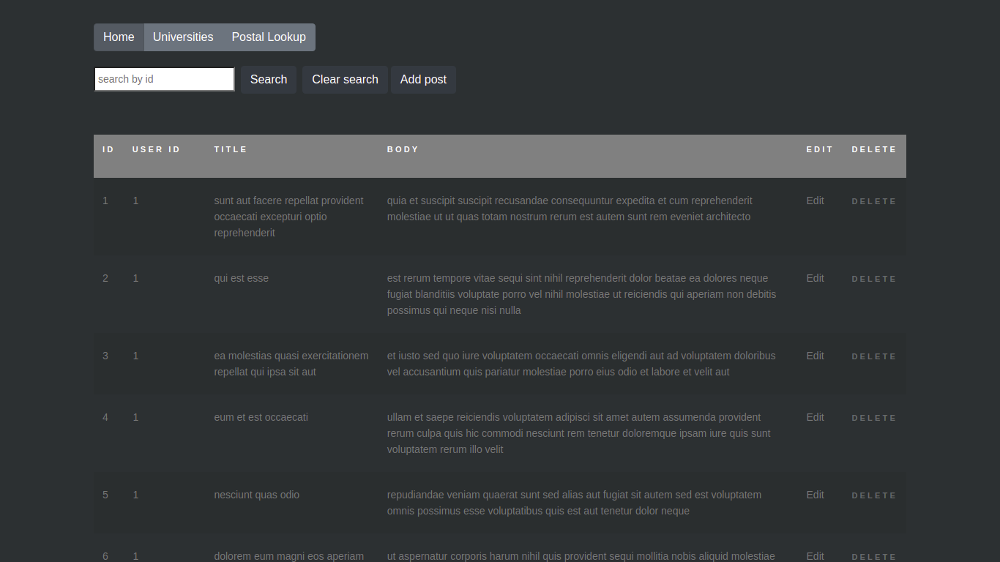

## Vog App Code challenge

#### Decription

1. At this code challenge we are looking for your coding skills, familiarity with JavaScript, React and Redux, utilizing best practices, clean coding, reusability, version control, teamwork and problem solving.
2. installation
   - git clone && cd openhouse-coding-exercise
   - npm install && npm start

#### Nice to have

1. Add some local mock data to respond to users when remote server is down.
2. add API key to cloud database to avoid dos attack
3. Use skeleton screen to make it more user friendly, due to time constraints, I used loading component instead.
4. Use media query to make it more responsive
5. For mobile side, add scroll down loading and scroll up refresh
6. typescript

#### Issue summary: N/A

#### API summary

1. functions: please review the code comments
2. posts endpoint:
   - [getAll]()
   - [add]()
   - [edit]()
   - [delete]()
3. universities endpoint: [hello]()
4. postal endpoint: [hello]()

#### Tech stack

- react
- axios/axios-cache-adapter
- react-bootstrap/antd
- redux/react-redux/redux-logger/redux-promise/redux-thunk
- connected-react-router

#### Screenshot

#### Contributor

- Feike Li

#### UI Reference

[bootstrap library](https://getbootstrap.com/)
[antd library](https://ant.design/index-cn)

#### Versions History

1. v1.0 home feature
2. v2.0 home feature/universities feature
3. v3.0 home feature/universities feature/postal lookup feature
